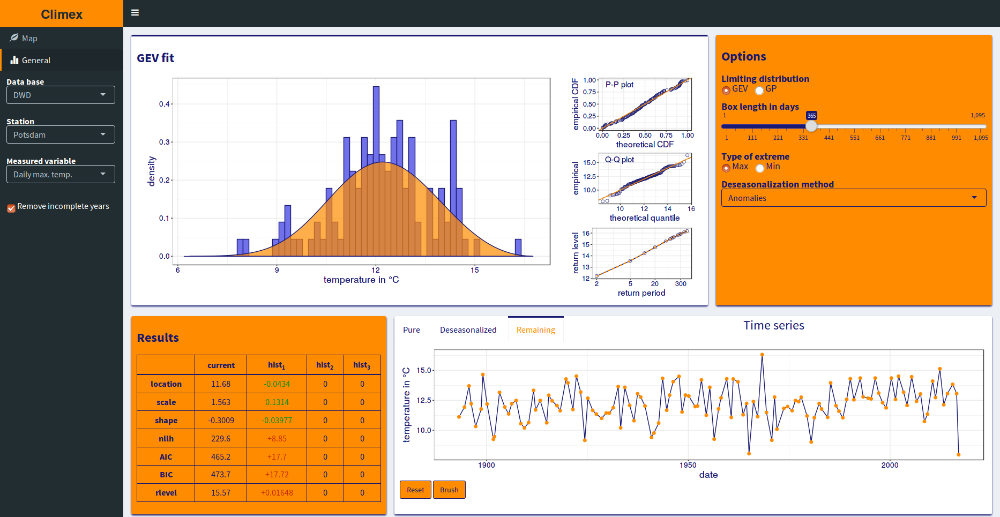

# Features

- You can perform the extreme value analysis for a large number of
  different stations.
- The package contains a script for downloading all station data of the German
  weather service (DWD) to get you started with your climate analysis.
  

- You have full control of all the steps involved in GEV fitting via an intuitive
  GUI in a persistent way (changes will be applied to the
  analysis of all following time series).
- The fitting is done using a maximum likelihood procedure especially
  tuned to produce the best possible results.
  

- You can verify whether the fitting procedure worked or got stucked in a
  local minimum via an animation.
  
# Installation

To install the app from within R you can use the [devtools](https://cran.r-project.org/web/packages/devtools/index.html) package.

```
devtools::install_github( "theGreatWhiteShark/climex" )
```

To get started with the shiny-based [web application](vignettes/climex_app.Rmd) and the [underlying
R functions](vignettes/data_dwd_and_usage.Rmd) please refer to the package's vignettes.

# Distinction from other packages fitting GEV distributions
Okay, so far so good. But **why** should you use this package instead of any other R packages out there performing both the GEV and GP fit?

1. This package's web application provides a GUI which makes it quite easily to work with a lot of time series, to try a lot of different approaches in the preprocessing and fitting and it features a map-based visualization enabling the user to compare results across different geographical locations.

2. In most packages (like **ismev**, **texmex**, **fExtremes**) the
   focus is in the handling of the time series at the R prompt but not
   on the fitting itself. They just call the optim function with its
   default values and use poor heuristic to determine the initial
   parameters to start the optimization. The **extRemes** package is
   the most advanced package handling extreme events and contains a
   more sophisticated heuristic for the initial parameters. But it
   calls the optim function to use the **BFGS** optimization routine
   instead of the default **Nelder-Mead** one. The author found this
   to be a big source of numerical instability introduced in the
   fitting procedure which makes it hard to parallelize over a lot of
   time series.  In this package on the other hand the focus lies on
   the most appropriate fitting procedure including an even more
   sophisticated heuristic and a lot of thoughts in the called fitting
   routine (I am about to submit a paper covering those aspects. More
   info soon). In the end its the correctness of the result that
   matters most. 


---

### License

This package is free software; you can redistribute it and/or modify it
under the terms of the GNU General Public License, version 3, as
published by the Free Software Foundation.

This program is distributed in the hope that it will be useful, but
without any warranty; without even the implied warranty of
merchantability or fitness for a particular purpose.  See the GNU
General Public License for more details.

A copy of the GNU General Public License, version 3, is available at
<http://www.r-project.org/Licenses/GPL-3>


