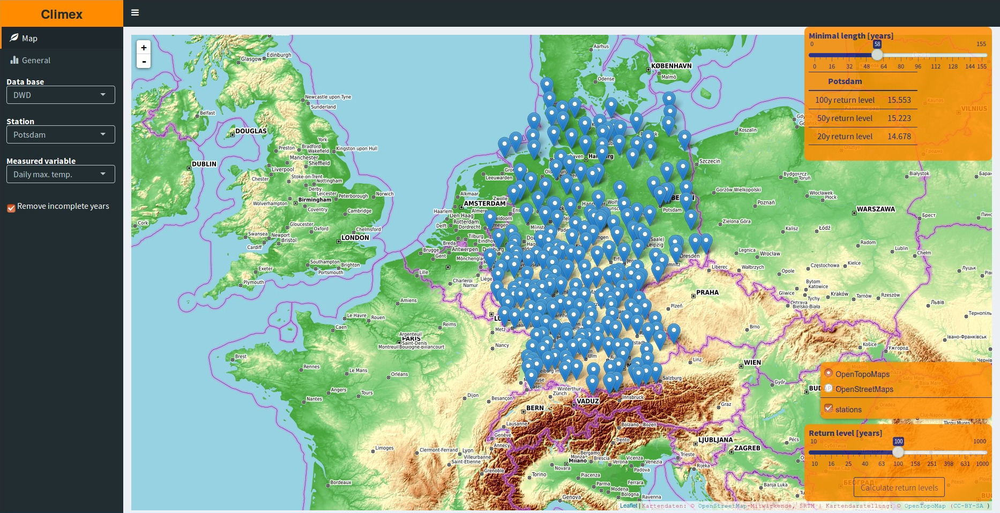
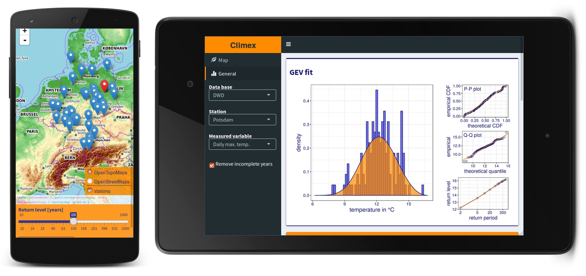

I'm leaving this sinking ship. If you like this project, checked out the maintained version on [GitLab.com](https://gitlab.com/theGreatWhiteShark/climex).

---


# Features




## An interactive web app


- You can perform extreme value analysis on a large number of
  climatic time series from different stations
- You can calculate arbitrary return levels for all 
  stations and display the results comprehensively on a map
  

- You have full control over all steps involved in the extreme value 
  analysis of the station data via an intuitive
  GUI in a persistent way (changes will be applied to the
  analysis of all following time series)
- Both the Generalized Extreme Value (GEV) and the Generalized
  Pareto (GP) approach are supported
- You can exclude single points or whole parts of a time series 
  with the entire analysis updated immediately
- The fitting is done using a nonlinear constrained maximum likelihood 
  procedure based on the augmented Lagrangian method. Using this approach
  none of your fits will produce numerical artifacts
  
[Try it!](http://climex.pks.mpg.de)

## A robust and sophisticated optimization (or why to use this package over others)

The fitting of GEV and GP parameters using unconstrained optimization
(done by all other R packages on extreme value statistics) tends to
produce numerical artifacts. This is due to the presence of logarithms
in the negative log-likelihood and a limited range of shape parameters
for which the likelihood estimator is defined. While producing
absurdly large parameters or causing the optimization to fail when
using the **BFGS** algorithm (*extRemes*), the differences using the
**Nelder-Mead** algorithm (all other packages) might be small, barely
noticeable, and totally plausible.

In order to avoid those numerical artifacts, the **augmented
Lagrangian method** is used to incorporate both the logarithms and the
limited range of shape parameters as nonlinear constraints. With this
approach the optimization can be started at arbitrary initial
parameter combinations and will almost always converge to the global
optimum.

This solves two of the remaining problems of the extreme value analysis:
1. The user does not have to worry about the numerical optimization
   anymore. It will always produce the correct results 
2. The optimization itself becomes more robust and can now be used in
   massive parallel applications 

## Convenient access to the station data of the DWD

In order to obtain loads of data to perform the analysis on and to
power the web application, this package contains some functions
scrapping the web page of the German weather service (DWD). Even if
you don't want to use the web app or the optimization routines, you
might still appreciate either the .Rdata objects containing all these
time series (of class *xts*) or the exported .csv versions of the
individual station data.

# Installation

Since the [Shiny](https://shiny.rstudio.com/)-based web app uses
rather new features of the R programming language, you have to have
**at least R-3.3.0** or newer (you can check your version by running
`R --version` in the terminal). If you don't fulfill this condition
yet, be sure to get the binary or source of an appropriate R version
via [CRAN](https://CRAN.R-project.org/).

In order to install this package, you have to use the *install_github*
function from the **devtools** package.

Just open a R shell on your computer and type in the following commands

``` r
## Installing the devtools package (in case your haven't done it yet).
install.packages( "devtools" )

## Installing the climex package from Github.
devtools::install_github( "theGreatWhiteShark/climex" )
```

This will install the climex package residing on the **master** branch
of this git repository. If you instead want to download and install a
different branch, use the *ref* argument to specify it. E.g.

``` r
devtools::install_github( "theGreatWhiteShark/climex", ref = "v1.2.0" )
```

Even if you do not intend to use the full capabilities of the package
but just parts like the download of the DWD data, be sure to
nevertheless install the whole package via the commands listed
above. It just uses 1.4 MB of space and you this way you ensure that
all required packages will be installed and all environmental
variables will be set.

### Server-side installation of the Climex web application

You want to run your own version of the Climex web application on one
of your servers so others can access it too? Then check out
[this](res/shiny-server/README.md) configuration guide.

# Usage

You are new to **R**? Then check out the [compiled list of
resources](https://www.rstudio.com/online-learning/#R) from RStudio or
the [official
introduction](https://CRAN.R-project.org/doc/manuals/R-intro.pdf).

A thorough introduction is provided for the [general
usage](res/README_data_dwd_and_usage.Rmd) of the package and the
Shiny-based [web application](res/climex_app.Rmd).

When using this package in your own analysis, keep in mind that its
functions expect your time series to be of class
[xts](https://CRAN.R-project.org/web/packages/xts/index.html) and not
numeric!

---

### License

This package is free software; you can redistribute it and/or modify it
under the terms of the GNU General Public License, version 3, as
published by the Free Software Foundation.

This program is distributed in the hope that it will be useful, but
without any warranty; without even the implied warranty of
merchantability or fitness for a particular purpose.  See the GNU
General Public License for more details.

A copy of the GNU General Public License, version 3, is available at
<http://www.r-project.org/Licenses/GPL-3>
